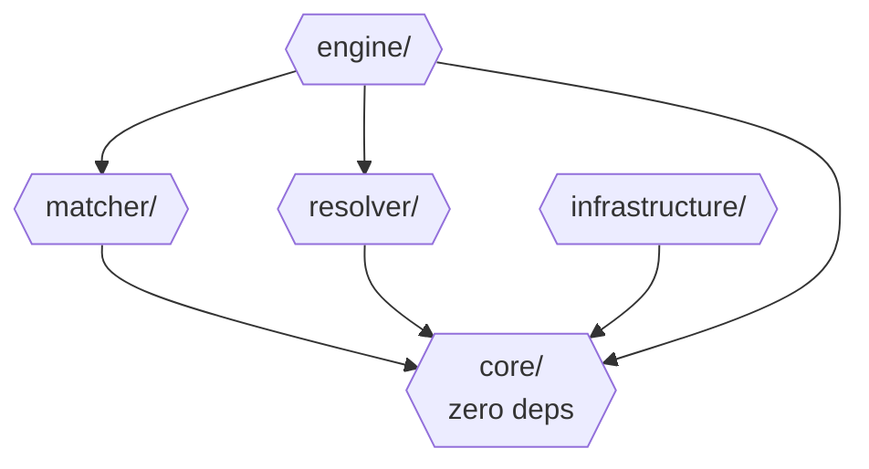

# Getting Started with Agent Guardrails

Welcome! This is the contributor gateway for Agent Guardrails — a policy engine that intercepts AI coding agent tool calls and enforces security rules before they execute.

## What This Project Does

Your AI coding agent shouldn't read `.env` files, decrypt secrets, or expose private keys. Agent Guardrails stops it before it happens.

```
Agent Tool Call → Match Rules → Resolve Action → Enforce
      ↓               ↓             ↓                   ↓
ToolCallContext   Rule Packs   GuardrailAction   Harness Specific
               (YAML)       + Fallback Chain      Behaviour
```

1. **ToolCallContext** — the adapter normalizes harness-specific events into this common shape
2. **Rule Packs** — match conditions (regex, file-path, predicate) and default actions that define what to watch for
3. **GuardrailAction** — the engine evaluates rules and resolves the action through a fallback chain
4. **Behaviour** — the adapter translates the resolved behaviour (`block`, `suggest`, `run`, `redact`, `confirm`) into harness-specific enforcement

## Where to Start

### 🟢 Easiest: Write a YAML Rule Pack

No TypeScript required. Write a YAML file describing what to watch for, submit a PR.

- **Format guide:** [rule-pack-guide.md](rule-pack-guide.md)
- **Examples:** Built-in packs in `src/packs/`
- **Ideas:** Check the backlog of planned packs below

### 🟡 Medium: Build an Adapter

Adapters are thin shims between a harness (Pi, OpenCode, Codex, Claude Code) and the engine. If your favorite harness isn't supported yet, this is a high-impact contribution.

The engine (`matchAndResolve` / `processMatch`) is a pure function with a stable public
API ([ADR-003](adrs/003-public-api-contract.md)). Import it directly as your harness's
permission-system implementation instead of writing rule matching from scratch. You own
the adapter glue; the engine owns matching, resolution, and fallback. See ADR-003's
Adapter Bootstrap Pattern for the full pattern.

#### Programmatic API

Adapters use the engine's public API to match and resolve actions:

```typescript
import { matchAndResolve, loadAllRulePacks, PredicateRegistry, StatsTracker } from "agent-guardrails";

// Construct collaborators — the caller owns their lifecycle
const registry = new PredicateRegistry();
const stats = new StatsTracker();

// Register adapter-specific predicates (if any)
registry.register("my-check", (ctx) => /* ... */);

const packs = loadAllRulePacks("./packs", registry);

const capabilities = {
  block: true,
  suggest: true,
  run: false,
  redact: false,
  confirm: true,
};

// On each tool call:
const action = matchAndResolve(
  { toolName: "bash", command: "cat .env" },
  packs,
  capabilities,
  registry,
  stats,
);

if (action?.type === "block") {
  console.log(action.message);
  // → "Blocked: `cat .env` — displaying .env file content may leak secrets."
}
```

Run `npm run docs` to generate the full API reference locally (outputs to `docs/api/`).

#### Adapter Capabilities (design target)

Not every harness supports every behavior. Source-verified per
[ADR-002](adrs/002-behavior-model.md) / [ADR-007](adrs/007-trust-and-self-protection.md).
Unsupported behaviors degrade via the [fallback chain](#fallback-chains). Pi and OpenCode
adapters are WIP; Codex and Claude Code are planned — see the main [README](../README.md#adapters).

| Harness     | `run` | `redact` | `confirm` | `tamperResistant` | `haltTurnBeforeTool` | `haltTurnAfterTool` |
| ----------- | :---: | :------: | :-------: | :----------------: | :-------------------: | :--------------------: |
| Pi          |  ✅   |    ✅    |    ✅     |         ❌          |           ✅           |           ✅            |
| OpenCode    |  ✅   |    ✅    |    ✅     |         ❌          |           ✅           |           ✅            |
| Claude Code |  ❌   |    ❌    |    ✅     |         ✅          |           ✅           |           ✅            |
| Codex       |  ❌   |    ❌    |    ✅     |         ✅          |           ❌           |           ✅            |

### 🔴 Deeper: Engine Improvements

Changes to the match conditions, resolver, or type system. Read the architecture docs first (below), then open an issue to discuss your approach.

## Architecture

Single package built around a dependency-free core. This is a hub-and-spoke layout, not
a linear stack: `core/` has zero outgoing imports, and `matcher/`, `resolver/`, and
`infrastructure/` each import *only* `core/` — they don't depend on each other. `engine/`
is the sole module that reaches beyond `core/`, importing `matcher/` and `resolver/` too.
Nothing ever imports `engine/` or `infrastructure/` — those are the outermost layers,
consumed by adapters, never by other internal modules.

```
                      ┌─────────────┐
                      │   matcher/  │
                      └─────────────┘
                             │
                             ▼
┌─────────────────┐   ┌─────────────┐   ┌─────────────────┐
│ infrastructure/ │──▶│    core/    │◀──│    resolver/    │
│                 │   │  zero deps  │   │                 │
└─────────────────┘   └─────────────┘   └─────────────────┘
     (→ core)                                (→ core)
                             ▲
                             │ (→ core)
                    ┌─────────────────┐
                    │     engine/     │
                    │   also imports  │
                    │    matcher/ +   │
                    │    resolver/    │
                    └─────────────────┘
```

This mirrors the classic **Ports & Adapters (Hexagonal Architecture)** convention — pure
domain logic in the middle, everything else plugged in around it, nothing reaching back
into the center's dependents. Rendered as a graph:



**Import rules** (hard constraints):

- `core/` imports nothing
- `matcher/` and `resolver/` import `core/` only
- `engine/` imports `core/`, `matcher/`, `resolver/` (never `infrastructure/`)
- `infrastructure/` imports `core/` only
- The `yaml` npm package (v2.4.0) is used ONLY in `infrastructure/yaml-pack-loader.ts`

### Fallback Chains

When a harness lacks a capability, the engine walks a deterministic chain:

- `run → suggest → block`
- `confirm → block` (or via `action.fallback` if defined — see [ADR-002](adrs/002-behavior-model.md))
- `redact → block`
- `suggest → block` (when no replacement available)

Implemented in `src/resolver/action-resolver.ts`. Adapters declare `HarnessCapabilities`; the engine handles the rest.

### Matching Layers

Three-layer defense-in-depth:

- **L1** Substring pre-filter — fast scan, catches wrappers
- **L2** Structural regex — precise, configured behavior
- **L3** Wrapper detection (`eval`, `bash -c`, `$()`) — triggers force-block

L1+L3 match = force-block regardless of L2 (adversarial pattern detected).

### Architectural Decisions

Agent Guardrails is built on six core architectural decisions. Read these in order:

| #   | ADR                                                      | What it covers                                                                                |
| --- | -------------------------------------------------------- | --------------------------------------------------------------------------------------------- |
| 1   | [Layered Architecture](adrs/001-layered-architecture.md) | Package structure, dependency direction, module responsibilities                              |
| 2   | [Behavior Model](adrs/002-behavior-model.md)             | What the engine can do (block/suggest/run/redact/confirm), phase constraints, fallback chains |
| 3   | [Public API Contract](adrs/003-public-api-contract.md)   | What's exported, what's internal, adapter bootstrap pattern                                   |
| 4   | [Matching Strategy](adrs/004-matching-strategy.md)       | Three-layer defense-in-depth, risk escalation, command splitting                              |
| 5   | [YAML Rule Packs](adrs/005-yaml-rule-packs.md)           | Why YAML, built-in packs, predicate limitations                                               |
| 6   | [Observability](adrs/006-observability-strategy.md)      | In-memory stats, tiered roadmap                                                               |

### Practical Guides

| Guide                                       | What it covers                                                 |
| ------------------------------------------- | -------------------------------------------------------------- |
| [How Matching Works](how-matching-works.md) | Layer-by-layer walkthrough with real command examples          |
| [Rule Pack Guide](rule-pack-guide.md)       | Complete YAML format spec, action types, defense-in-depth tips |

## Key Vocabulary

Agent Guardrails uses precise terms. Here's what you need to know:

| Term              | Meaning                                                                                                                                                                                                        |
| ----------------- | ------------------------------------------------------------------------------------------------------------------------------------------------------------------------------------------------------------- |
| Rule              | Detection pattern + phase + default action                                                                                                                                                                    |
| Rule Pack         | Named collection of rules (YAML or TypeScript)                                                                                                                                                                |
| Behavior          | Category: block/suggest/run/redact/confirm                                                                                                                                                                    |
| Action            | Concrete response object (e.g., a suggest action with replacement + message)                                                                                                                                  |
| Phase             | When a rule fires: before-tool or after-tool                                                                                                                                                                  |
| ToolCallContext   | Normalized input from a harness (discriminated union on `toolName`)                                                                                                                                           |
| Adapter           | Integration shim for a specific harness (Pi, OpenCode, etc.)                                                                                                                                                  |
| Harness           | The platform (Pi, OpenCode). NOT the agent (the AI model).                                                                                                                                                    |
| Fallback Chain    | Deterministic degradation when a harness lacks a capability                                                                                                                                                   |
| Matcher           | User-facing name for a match condition: bash-command (regex), file-path (regex), or predicate (TypeScript function). Internally represented as a `MatchCondition` discriminated union.                       |
| Match Condition   | A rule's `match` field — a declarative spec that the engine evaluates via `matchesMatcher()`. Type alias: `MatchCondition`.                                                                                  |
| Default Decision  | The default action of the implicit catch-all rule that fires when nothing else matches (`allow \| suggest \| confirm \| block`, default `allow`). See [ADR-007](adrs/007-trust-and-self-protection.md).      |
| Overridable       | Rule-level flag; `false` locks a built-in rule against user config overrides. Not available to community packs. See [ADR-007](adrs/007-trust-and-self-protection.md).                                        |
| Tamper-Resistant  | Adapter capability declaring whether it runs as an external hook process (harder to tamper with) vs. an in-process plugin. See [ADR-007](adrs/007-trust-and-self-protection.md).                             |
| Turn Halt         | `haltTurn` modifier on `block`/`redact` actions that stops the agent's current turn, not the session. See [ADR-002](adrs/002-behavior-model.md).                                                              |

### Don't Confuse These

- **Behavior vs Action:** Behavior is the category (block/suggest/run/redact/confirm). Action is the concrete response object (e.g., a "suggest action" with a replacement and message).
- **Rule Pack vs package:** A rule pack is a domain concept (a collection of rules). A package is the npm artifact.
- **Harness vs agent:** The harness is the platform (Pi, OpenCode). The agent is the AI model running inside it. Adapters integrate with harnesses, not agents.

## Code Style (Quick Reference)

- TypeScript strict mode, no `any`, no `!` non-null assertions
- Named exports only — no default exports
- Format with oxfmt (single quotes, no semicolons, 100 char print width)
- Tests colocated: `file.test.ts` next to `file.ts`

The linter and formatter catch most issues. See [CONTRIBUTING.md](../CONTRIBUTING.md) for the full setup.

## Questions?

1. **Architecture unclear?** Read the ADRs in order — they explain the _why_, not just the _what_.
2. **Rule pack logic tricky?** Check [how-matching-works.md](how-matching-works.md) for the layer-by-layer examples.
3. **Need to discuss?** Open an issue first. We'd rather talk about your approach for 10 minutes than review a 500-line PR that misses the mark.

## Reporting Security Issues

See [SECURITY.md](../SECURITY.md) — please report privately!
